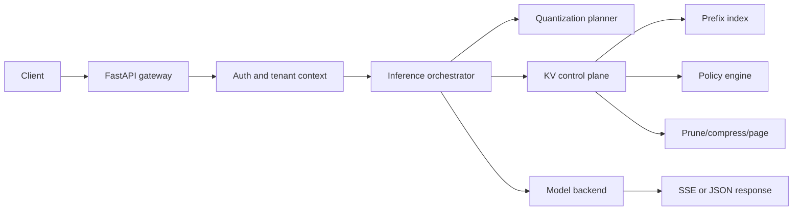

# Architecture

`kvserve` is organized around the assumption that KV memory is the binding
constraint for generation workloads. The OpenAI-compatible API is only the outer
contract; internally every generation request is admitted by the KV control
plane before a backend receives it.

## Layers

1. API gateway
   - FastAPI/Uvicorn service.
   - Bearer token authentication maps each token to exactly one tenant.
   - Per-tenant token-bucket rate limiting.
   - OpenAI-compatible routes:
     - `GET /v1/models`
     - `POST /v1/embeddings`
     - `POST /v1/chat/completions`
     - `POST /v1/chat`
     - `POST /v1/rerank`
     - `POST /v1/reranking`
   - SSE streaming uses OpenAI delta chunks and emits final usage.
   - MCP-over-HTTP is exposed at `/mcp`.

2. Inference orchestrator
   - Validates model task type.
   - Applies chat templates.
   - Adds tool and structured-output control instructions.
   - Calls the quantization planner.
   - Calls the KV control plane for admission and policy selection.
   - Refuses generation backends that cannot prove optimized KV unless the
     model registry explicitly sets `force_unoptimized_kv=true`.

3. KV memory control plane
   - Tenant-safe prefix index for exact and near-prefix KV reuse.
   - Dynamic policy engine driven by memory pressure, concurrency, context
     length, latency target, and model capabilities.
   - Selective pruning that preserves recent and high-attention tokens.
   - Compression engine with standard FP16 storage, scaled FP8 E4M3, and
     TurboQuant-style rotated low-bit quantization with residual correction.
   - GPU/CPU/NVMe page lifecycle with prefetch and LRU demotion.

4. Model backends
   - `vllm` primary backend with prefix caching enabled and FP8 KV cache wiring
     when the registry selects FP8 KV.
   - `transformers` fallback backend for explicit dev/fallback use.
   - `dev` deterministic backend for smoke tests and CPU-only deployment checks.

## Repository Structure

```text
config/
  model_registry.json
docs/
  architecture.md
  benchmark-plan.md
  implementation-plan.md
  kv-control-plane.md
  openapi.json
  quantization-planner.md
  risk-analysis.md
  training-and-weights.md
scripts/
  benchmark.py
  register_model.py
src/kvserve/
  api/                 FastAPI schemas, routes, auth, rate limiting, middleware
  backends/            backend protocol plus dev, vLLM, Transformers adapters
  kv/                  compression, prefix reuse, policy, pruning, paging
  mcp/                 MCP HTTP/JSON-RPC server
  models/              registry schema and loader
  observability/       Prometheus metrics
  quantization/        hardware detection and quantization planning
  app.py               app factory
  orchestrator.py      request routing and KV admission path
tests/
```

## Request Path



## KV Safety Contract

Generation models set `kv_required=true`. The orchestrator enforces this:

- dev backend: control-plane KV compression is materialized for validation.
- vLLM backend: allowed when optimized KV is native and configured, currently
  FP8 KV plus prefix caching.
- Transformers backend: allowed only when the registry explicitly forces an
  unoptimized fallback.
- Any unsupported backend/KV combination returns a `409 kv_policy_error`.

This prevents silent unoptimized KV execution.
