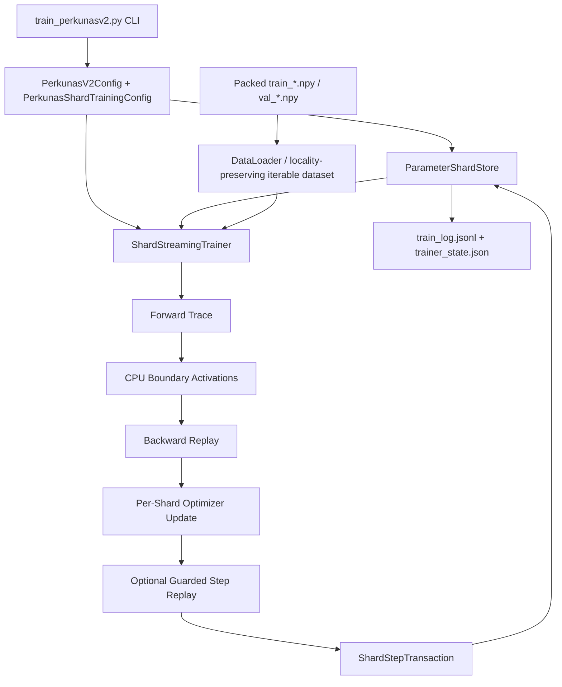
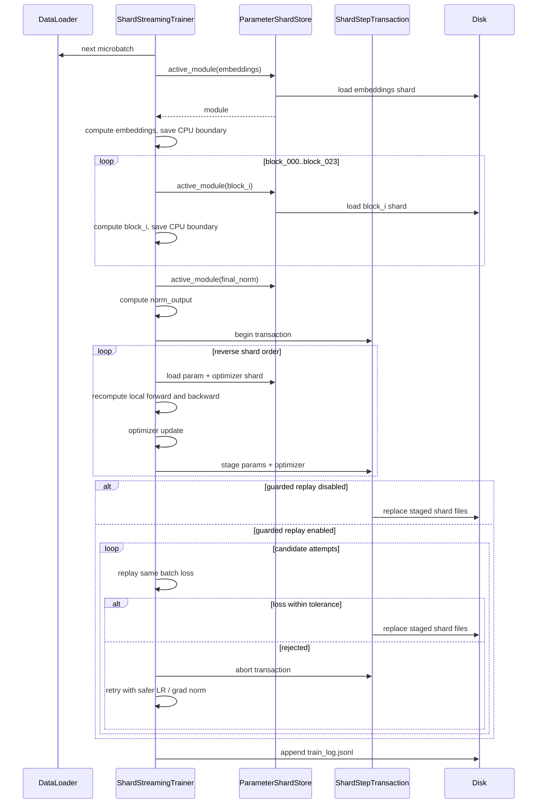

# Perkunasv2 Training and Serving Architecture Low-Level Design

Version: draft 0.4  
Date: 2026-05-01  
Companion document: `docs/perkunasv2_shard_native_whitepaper.md`

## 1. Purpose

This document describes the low-level training and serving architecture for Perkunasv2, a shard-native language-model training runtime with post-training export paths for standard inference runtimes. The whitepaper explains the scientific and commercial argument. This LLD explains the concrete implementation: runtime components, file layout, control flow, memory residency, update mechanics, persistence model, observability, serving modes, export packaging, and known engineering risks.

Perkunasv2's core design decision is:

> The durable parameter and optimizer shards are the model.

The trainer does not create one full resident `nn.Module` and then shard it as an implementation detail. Instead, it loads, computes, updates, and persists one logical shard at a time.

Serving is intentionally split from training. The shard-native host can query a stopped run directory for diagnostics, but the production-oriented route is to export a frozen training run into a Hugging Face / Llama-compatible safetensors package and serve that artifact with vLLM or another mature inference runtime.

## 2. Goals and Non-Goals

Goals:

- Train decoder-only GPT-style models on hardware that cannot hold the full model and optimizer state in GPU memory.
- Keep peak active GPU residency bounded to a small number of shards.
- Persist parameters, optimizer state, trainer state, and logs in a resumable run directory.
- Support fp16/bf16/fp32 active compute with optional fp32 master-weight storage.
- Support shard-local updates, full-model global gradient clipping, and periodic scalar-only global optimizer normalization.
- Support experimental guarded step replay: stage a candidate update, replay the same batch, and retry or skip clearly harmful updates without publishing rejected shards.
- Support RAM-disk active stores with lower-frequency durable publication back to the NVMe run directory.
- Preserve data-loader locality when shuffling very large packed-token corpora.
- Provide enough telemetry to prove whether the system is learning and where time is spent.
- Provide a local OpenAI-style test server for stopped shard-native runs.
- Export trained shard-native checkpoints into Hugging Face / vLLM-compatible safetensors packages.

Non-goals in the current implementation:

- Full production distributed training.
- Fast production shard-native inference as the primary serving path.
- Fully atomic whole-step replacement after machine crash during the final publish loop.
- Immutable rewindable checkpoint snapshots for arbitrary earlier steps.
- Guaranteed monotonic training loss across unrelated batches.
- A production-grade shard-native decode scheduler with batching, paged KV cache, and token streaming.
- A formal DeepSpeed/FSDP replacement claim.

## 3. Source Map

| Component | File | Responsibility |
| --- | --- | --- |
| Model config | `training/src/perkunas_training/perkunasv2/configuration.py` | Defines `PerkunasV2Config` and validates architecture constraints. |
| Training config | `training/src/perkunas_training/perkunasv2/configuration.py` | Defines `PerkunasShardTrainingConfig` and validates runtime knobs. |
| Modules | `training/src/perkunas_training/perkunasv2/modules.py` | Defines RMSNorm, rotary attention, SwiGLU, transformer block, embeddings, final norm, and lm head builders. |
| Shard store | `training/src/perkunas_training/perkunasv2/shard_store.py` | Owns shard paths, load/save, storage format, prefetch caches, transaction staging, and residency accounting. |
| Trainer | `training/src/perkunas_training/perkunasv2/trainer.py` | Coordinates data loading, forward trace, backward replay, optimizer updates, validation, logging, and checkpoints. |
| CLI | `training/src/perkunas_training/perkunasv2/train_perkunasv2.py` | Exposes `--init-shards`, `--train`, and `--validate`. |
| Tokenization | `training/src/perkunas_training/perkunasv2/c4_tokenize.py` | Builds packed `.npy` training and validation shards. |
| Packed datasets | `training/src/perkunas_training/train/dataset.py` | Provides map-style packed-token reads and locality-preserving iterable shuffled reads. |
| Inference/server | `training/src/perkunas_training/perkunasv2/inference.py`, `serve.py` | Loads shard-native model state for local serving and test generation. |
| HF/vLLM export | `training/src/perkunas_training/perkunasv2/hf_export.py`, `training/scripts/export_perkunasv2_hf.py` | Converts a Perkunasv2 run directory into a Llama-compatible Hugging Face safetensors package. |

## 4. Runtime Directory Layout

A Perkunasv2 run directory is the durable model boundary:

```text
training/runs/Perkunas_v2.8_50m_correct_vocab/
  config.json
  trainer_state.json
  train_log.jsonl
  durable_flush_manifest.json
  checkpoints/
    step_00000100.json
    ...
  shards/
    metadata.json
    params/
      embeddings.pt
      block_000.pt
      ...
      block_<N>.pt
      final_norm.pt
      lm_head.pt
    optim/
      embeddings.pt
      block_000.pt
      ...
      block_<N>.pt
      final_norm.pt
      lm_head.pt
    transactions/
      step_00000042/
        params/
        optim/
```

When `--active-run-dir` is provided, the trainer uses a two-tier layout:

```text
training/runs/Perkunas_v2.8_50m_correct_vocab/   durable archive
E:/Perkunas_v2.8_50m_correct_vocab_active/       active working store
```

The active store is copied from the durable archive before training and receives high-frequency shard updates. Durable flush publishes the active store back to `--run-dir` at configured boundaries.

Current checkpoint files are marker metadata for the live shard store, not full immutable snapshots. Resuming the current coherent run state is supported; rewinding to an arbitrary earlier step requires a separately preserved full copy until snapshot directories are implemented.

For `safetensors` storage, logical shards may be stored as single files:

```text
block_000.safetensors
```

or split into physical storage parts:

```text
block_000.part_000.safetensors
block_000.part_001.safetensors
...
```

Logical model shards remain the same even when physical storage is split.

## 5. Logical Sharding Contract

For each decoder-only model, the logical shard list is:

```text
embeddings
block_000
block_001
...
block_<N>
final_norm
lm_head
```

The shard count is determined by `num_layers`:

- 1 embedding shard.
- `num_layers` transformer block shards.
- 1 final normalization shard.
- 1 language-model-head shard.

Examples:

```text
24-layer family: 27 logical shards
9-layer 50M family: 12 logical shards
```

Each logical parameter shard has a matching optimizer shard. This is the central persistence invariant:

```text
params/<shard_name> must match optim/<shard_name>
```

The end-of-step log should normally show:

```text
updated_shards: <expected logical shard count>
optimizer_shards_touched: <expected logical shard count>
max_active_param_shards_observed: 1
max_active_optimizer_shards_observed: 1
```

That means all logical shards were updated while the active residency stayed bounded.

## 6. High-Level Control Flow



## 7. Training Step Lifecycle

Each training step follows this sequence:

1. Load and reconcile `trainer_state.json`.
2. Restore saved RNG state if present.
3. Build the train loader with either sequential order or locality-preserving shuffled shard order.
4. For each gradient-accumulation microbatch:
   - Load one input/label batch.
   - Run a shard-streamed forward trace.
   - Save CPU boundary activations.
5. Compute the token-based or step-based learning rate.
6. Start a `ShardStepTransaction`.
7. Run backward replay:
   - Either shard-local clipping/update.
   - Or global-gradient collection followed by globally scaled updates.
   - Or, on scheduled steps, periodic global optimizer normalization followed by shard-local updates.
8. Stage all parameter and optimizer shards into the transaction directory.
9. If guarded step replay is enabled:
   - Replay the same batch against the candidate staged state.
   - Accept and commit if the same-batch loss is within tolerance.
   - Otherwise abort and retry with the next configured LR / grad-norm scale.
   - If all attempts fail, either commit the final safer attempt or skip the update.
10. Commit the accepted transaction.
11. Prime prefetch for the next step.
12. Save `trainer_state.json`.
13. Run validation if scheduled.
14. Write checkpoint marker if scheduled.
15. Append a training row to `train_log.jsonl`.

Step 14 writes marker metadata today. It does not snapshot all shard files for rewind.



## 8. Forward Trace Design

The forward pass is intentionally not a normal retained autograd graph. It is a trace of shard boundaries:

```text
input ids
  -> embeddings
  -> boundary[0]
  -> block_000
  -> boundary[1]
  ...
  -> block_023
  -> boundary[24]
  -> final_norm
  -> norm_output
```

`MicroBatchTrace` stores:

- `input_ids`
- `labels`
- `boundaries`
- `norm_output`
- optional `loss`

Boundaries are detached to CPU. This is what lets the trainer release active GPU modules instead of keeping a full autograd graph alive.

## 9. Backward Replay Design

Backward replay walks the model in reverse:

```text
lm_head
final_norm
block_023
...
block_000
embeddings
```

For each shard, the trainer:

1. Loads the shard as an active module.
2. Recreates the local forward computation from saved boundaries.
3. Runs local backward using the downstream gradient.
4. Updates the shard's parameters.
5. Saves updated parameter and optimizer state.
6. Releases the active module.

This is the tradeoff at the center of the platform:

```text
less resident memory, more recomputation and I/O
```

## 10. Gradient Clipping Modes

Perkunasv2 supports two clipping modes and one periodic global-normalization overlay.

### 10.1 Shard-Local Clipping

```text
--grad-clip-mode shard
```

Each shard clips its own gradients before the optimizer step. This is faster and more streaming-friendly, but not identical to full-model clipping because each shard gets its own norm budget.

### 10.2 Global Clipping

```text
--grad-clip-mode global
```

Global mode is a two-phase update:

1. Backward replay collects CPU gradient payloads for every shard.
2. The trainer computes one full-model norm.
3. The trainer computes one scale:

```text
global_grad_clip_scale = min(1.0, max_grad_norm / global_grad_norm)
```

4. The trainer applies the same scale to every shard's gradients before optimizer update.

This better matches standard full-resident training semantics. It is slower because gradients must be retained long enough to compute the full-model norm.

### 10.3 Periodic Global Optimizer Normalizer

```text
--global-optimizer-every N
--global-optimizer-blend 0.25
--global-optimizer-min-scale 0.5
--global-optimizer-max-scale 2.0
```

This mode is designed for the memory-constrained case where `--grad-clip-mode global` every step is too expensive. Every `N` steps, the trainer:

1. Runs a global gradient-statistics pass.
2. Computes total gradient norm and target gradient RMS across all parameters.
3. Computes one scalar normalization factor per shard.
4. Clamps each scalar into `[min_scale, max_scale]`.
5. Blends the scalar back toward `1.0` using `global_optimizer_blend`.
6. Replays shard-local updates with the scalar applied to each shard's gradients.

No global AdamW object is created. No full-model optimizer state is resident. The only global information retained across the scheduled step is scalar statistics and per-shard scalar factors. The recommended usage is:

```text
--grad-clip-mode shard
--global-optimizer-every 50
```

Using `--grad-clip-mode global` and `--global-optimizer-every` together is legal, but it keeps the expensive full-model gradient path active every step and should be treated as a diagnostic recipe.

### 10.4 Guarded Step Replay Safety Overlay

```text
--guarded-step-replay
--guard-replay-max-replays 2
--guard-replay-loss-tolerance 0.02
--guard-replay-loss-tolerance-ratio 0.002
--guard-replay-lr-scales 1.0,0.5,0.25
--guard-replay-grad-norm-scales 1.0,0.75,0.5
--guard-replay-on-exhaust accept|skip
```

Guarded step replay wraps the normal shard update path. It does not introduce a new optimizer. It uses the existing `ShardStepTransaction` staging directory as a candidate state:

1. The trainer computes the normal forward trace for the current batch.
2. The trainer runs backward replay and stages all candidate parameter and optimizer shards.
3. The trainer replays the same batch with `compute_loss=True`.
4. The candidate is accepted when:

```text
loss_after <= loss_before
            + guard_replay_loss_tolerance
            + abs(loss_before) * guard_replay_loss_tolerance_ratio
```

5. If rejected, the transaction is aborted and the step is retried with the next configured LR and max-grad-norm scale.
6. If all attempts are rejected:
   - `accept` commits the final attempted safer update.
   - `skip` aborts the final candidate, advances the data stream, and does not increment `optimizer_step`.

This guard is intentionally same-batch. It must not compare step `N` loss against step `N-1` loss because those batches can have different difficulty. The feature is a damage limiter for clearly harmful updates, not a promise of monotonic training loss.

## 11. Optimizer and Master Weight Design

The trainer does not hold a global optimizer object. Instead, every shard owns its own optimizer payload. The periodic global optimizer normalizer is scalar-only and does not change this persistence model.

Supported optimizer modes:

- `adamw`
- `lion`
- `adafactor`

The recommended current path is AdamW with fp32 master weights:

```text
--dtype fp16
--master-weight-dtype fp32
--optimizer adamw
```

Active compute can be fp16 while canonical parameter storage remains fp32. This protects small updates from being rounded away in the durable shard store.

Conceptually:

```text
active module on GPU:       fp16
parameter master shard:     fp32
optimizer moments:          fp32
saved canonical shard:      fp32
```

## 12. Data Pipeline

The trainer consumes packed `.npy` token shards. For each item, the loader returns:

```text
input_ids: sequence tokens shifted left
labels:    next-token labels
```

Current operational points:

- Training data is expected under `--data-dir`.
- Validation data is expected under `--val-data-dir`.
- Validation fallback to training data is disabled unless explicitly allowed.
- `--seq-len` must match the packed shard sequence length; a packed 512-token dataset cannot be trained as 2048-token samples without retokenizing/repacking.
- Current C4 packed shards use the project 8,000-token vocabulary. Corrected configs should set `vocab_size=8000` unless deliberately testing an expanded output head.
- `--shuffle-train` now uses a locality-preserving iterable dataset for training. It shuffles file/shard order, then reads rows sequentially inside each file.
- `--no-shuffle-train` remains the strict sequential streaming mode.

The current large training set created a practical loader issue: fully shuffled map-style access across many memory-mapped files was much slower than sequential streaming and could build a massive full-dataset random permutation. The locality-preserving iterable path is the current mitigation. Remaining data work is to add a lazy LRU shard cache or repack the corpus into fewer, larger token shards for Windows-friendly file-handle behavior.

## 13. Storage and Transaction Design

`ParameterShardStore` supports:

- Torch `.pt` shard payloads.
- Safetensors shard payloads.
- Multi-part safetensors storage.
- Async shard writes.
- CPU/GPU/secondary-GPU prefetch.
- Residency accounting.
- Stale transaction cleanup.
- RAM-disk active stores with durable archive flush.

Each training step stages writes into:

```text
shards/transactions/step_<step>/
```

The transaction must contain every expected parameter shard and optimizer shard before it can commit. The commit then replaces live files with staged files.

Current transaction guarantee:

- Incomplete step transactions are not committed.
- Normal exceptions abort and clean the transaction directory.
- Stale transaction directories are discarded on resume.

Current known gap:

- If the machine dies during the final file replacement loop, the live shard directory can contain a mixed-step model. The roadmap item is a step manifest or pointer-swap scheme that makes the live set snapshot-pinned.
- Checkpoint markers are not immutable snapshots. Rewind requires a full copied snapshot until `checkpoints/step_<N>/shards/...` is implemented.

When `--active-run-dir` is set, the store's high-churn reads and writes happen in the active directory. `--durable-flush-every N` publishes the active store back to the durable `--run-dir` every `N` steps. If the value is `0`, publication occurs at save boundaries and final step.

## 14. Prefetch and Residency

Prefetch is configured by:

```text
--prefetch-shards off|cpu|gpu|secondary-gpu
--prefetch-window N
--prefetch-optimizer-shards
--prefetch-device cuda:1
```

The store tracks:

- active parameter shards
- active optimizer shards
- cached parameter payloads
- cached optimizer payloads
- pending parameter prefetches
- pending optimizer prefetches
- cached active modules if enabled

End-of-step logs often show:

```text
active_param_shards: {}
active_optimizer_shards: {}
resident_parameter_count: 0
resident_optimizer_state_count: 0
```

That is expected because active shards are released before logging. The important proof fields are:

```text
updated_shards
optimizer_shards_touched
max_active_param_shards_observed
max_active_optimizer_shards_observed
cached_param_shards
cached_optimizer_shards
```

## 15. Observability

Each step appends JSON to:

```text
train_log.jsonl
```

Important fields:

| Field | Meaning |
| --- | --- |
| `step` | Global training step. |
| `train_loss` | Mean training loss for the step. |
| `lr` | Effective learning rate after schedule. |
| `tokens_per_sec` | Step token throughput. |
| `step_seconds` | Full wall time for the step. |
| `forward_trace_seconds` | Forward trace wall time. |
| `data_load_seconds` | Time waiting for data. |
| `forward_compute_seconds` | Forward compute excluding data wait. |
| `shard_update_seconds` | Total backward/update/commit section. |
| `backward_update_seconds` | Backward replay plus optimizer work. |
| `commit_seconds` | Transaction publish time. |
| `param_load_seconds` | Time loading parameter payloads. |
| `module_build_seconds` | Time constructing active modules from shard payloads. |
| `h2d_seconds` | Host-to-device transfer time for active modules and tensors. |
| `forward_kernel_seconds` | Timed forward CUDA work. |
| `backward_kernel_seconds` | Timed backward CUDA work. |
| `activation_cpu_copy_seconds` | Boundary activation copy time back to CPU. |
| `gradient_cpu_copy_seconds` | Gradient copy time back to CPU. |
| `optimizer_load_seconds` | Time loading optimizer shard payloads. |
| `optimizer_math_seconds` | Time applying optimizer math. |
| `param_save_stage_seconds` | Parameter shard save/stage time. |
| `optimizer_save_stage_seconds` | Optimizer shard save/stage time. |
| `grad_norm` | Per-shard gradient norm summary. |
| `global_grad_norm` | Full-model gradient norm estimate for the step. |
| `global_grad_clip_scale` | Global clip scale when global mode is enabled. |
| `global_optimizer` | Periodic global-normalizer statistics on scheduled steps. |
| `guarded_step_replay` | Guarded replay attempt log, accepted/rejected status, replay losses, LR scale, and grad-norm scale. |
| `grad_clip_mode` | `shard` or `global`. |
| `updated_shards` | Number of logical parameter shards updated. |
| `optimizer_shards_touched` | Number of optimizer shards loaded/updated. |
| `memory` | CUDA allocated/reserved/peak memory. |
| `residency` | Shard cache and active residency state. |

`--timing-sync-cuda` can be used for diagnostic timing. It synchronizes around timed CUDA regions and therefore should not be used for clean throughput comparisons.

## 16. Serving and Export Design

Perkunasv2 has three serving modes:

1. Shard-native local test serving from a stopped run directory.
2. Hugging Face / vLLM serving from an exported safetensors package.
3. `kvserve` serving for integration with the broader OpenAI-style API layer.

The serving split is deliberate:

```text
training path:
  canonical shard store
  bounded active residency
  optimizer shards
  guarded updates
  validation and recovery

serving path:
  frozen checkpoint
  resident inference weights when available
  KV cache
  batching / streaming / API compatibility
```

The shard-native test host is implemented by:

```text
training/src/perkunas_training/perkunasv2/inference.py
training/src/perkunas_training/perkunasv2/serve.py
training/scripts/serve_perkunasv2.py
```

It supports:

```text
GET  /health
GET  /models
GET  /v1/models
POST /generate
POST /compare
POST /v1/chat/completions
POST /v1/completions
POST /v1/models/{model_name}/preload
```

Important local-serving implementation details:

- `PerkunasV2ShardGenerator` can preload and cache active modules for faster stopped-run testing.
- A KV-cache path exists for local generation, but this is not yet a production decode scheduler.
- Prompt encoding strips the tokenizer's trailing EOS for generation prompts.
- Generation suppresses PAD and BOS tokens by default to prevent mid-generation reset behavior.
- The chat endpoint accepts OpenAI-style request bodies, but the model remains a base model unless separately instruction-tuned.
- Serving a mutable training directory is unsafe; serve a stopped run or copied snapshot.

The HF/vLLM export path is implemented by:

```text
training/src/perkunas_training/perkunasv2/hf_export.py
training/scripts/export_perkunasv2_hf.py
```

It reads Perkunas training shards in either `.pt` or `.safetensors` format and emits a Llama-compatible Hugging Face package:

```text
config.json
generation_config.json
model.safetensors
tokenizer.json
tokenizer_config.json
special_tokens_map.json
perkunas_export_manifest.json
README.md
```

The exporter maps Perkunas tensors to standard Llama tensor names. The only structural transformation is splitting the fused SwiGLU `mlp.gate_up.weight` into:

```text
model.layers.<i>.mlp.gate_proj.weight
model.layers.<i>.mlp.up_proj.weight
```

The training storage format and serving storage format are independent. A run may train with legacy `.pt` shards and still export to `model.safetensors`; that conversion is the purpose of the packager.

Example export command:

```powershell
python training/scripts/export_perkunasv2_hf.py `
  --run-dir training/runs/Perkunas_v2.9_100m_tinystories `
  --tokenizer-dir training/tokenizer/perkunas-hf-blend-tokenizer `
  --output-dir exports/Perkunas_v2.9_100m_tinystories_vllm `
  --dtype fp16 `
  --overwrite
```

Example vLLM command from WSL/Linux:

```bash
vllm serve /mnt/d/LLMProject/exports/Perkunas_v2.9_100m_tinystories_vllm \
  --dtype float16 \
  --served-model-name perkunas-v2.9 \
  --host 127.0.0.1 \
  --port 8011
```

This route may need more inference VRAM than shard-native serving. That is acceptable: Perkunas optimizes the training phase for low active residency, then allows the serving phase to use a mature fast runtime when resident inference is possible.

## 17. Reference Runs

### v2.8 Corrected-Vocab Reference Run

The current 50M-class reference line uses the corrected tokenizer/model contract:

```text
parameters:                 55,963,520
vocab_size:                 8000
sequence length:            512
micro_batch_size:           192 in the initial run
gradient_accumulation:      4
effective tokens/update:    393,216
dtype:                      fp16
master_weight_dtype:        fp32
optimizer:                  AdamW
learning rate:              3e-5 initial recipe
weight decay:               0.05 initial recipe
grad clip mode:             global in the initial run
max grad norm:              0.5
storage:                    torch shard files
active store:               RAM disk
durable archive:            NVMe run directory
prefetch:                   cpu
training order:             locality-preserving shuffle
logical shards updated:     12 per step
```

Held-out validation observations:

| Step | Val Loss | Val Perplexity | Batches |
| ---: | ---: | ---: | ---: |
| 100 | 8.2274 | 3,742.22 | 100 |
| 300 | 7.9033 | 2,706.16 | 100 |
| 500 | 7.7313 | 2,278.49 | 100 |
| 700 | 7.7639 | 2,354.01 | 100 |
| 900 | 7.7232 | 2,260.10 | 100 |
| 1100 | 7.7159 | 2,243.79 | 100 |
| 1300 | 7.6752 | 2,154.16 | 100 |

This is mechanically healthy:

- Loss is below the corrected random baseline `ln(8000) = 8.99`.
- Every step updates all 12 logical shards.
- RAM-disk active storage is working, but timing logs show rebuild and host-to-device copy remain major costs.
- The run is the corrected 50M-class baseline; older v2.6 32k-vocab results remain historical evidence, not the recommended recipe.

### v2.9 100M TinyStories Reference Run

The current 100M-class TinyStories line uses:

```text
parameters:                 100,487,424
vocab_size:                 8000
hidden_size:                768
num_layers:                 13
num_heads:                  12
intermediate_size:          1920
sequence length:            512
dtype:                      fp16 active compute
master_weight_dtype:        fp32
optimizer:                  AdamW
storage:                    torch shard files during training
export:                     HF/Llama-compatible safetensors package
logical shards updated:     16 per step
```

Held-out validation observations:

| Step | Val Loss | Val Perplexity | Batches |
| ---: | ---: | ---: | ---: |
| 1600 | 4.1140 | 61.19 | 100 |
| 1700 | 3.9910 | 54.11 | 100 |
| 1800 | 3.9547 | 52.18 | 100 |
| 1900 | 3.9178 | 50.29 | 100 |
| 2000 | 3.9007 | 49.44 | 100 |
| 2100 | 3.8389 | 46.48 | 100 |
| 2200 | 3.7610 | 42.99 | 100 |
| 2400 | 3.5857 | 36.08 | 100 |
| 2800 | 3.5414 | 34.52 | 100 |
| 2900 | 3.5214 | 33.83 | 100 |
| 3000 | 3.5135 | 33.57 | 100 |

This run currently provides the strongest small-system result:

- It confirms the streaming trainer can move from 50M-class to 100M-class under the same memory-first design.
- It exposes the difference between short-window train-loss floors and held-out validation trend.
- It motivated the serving split: shard-native serving is useful for diagnostics, while exported vLLM serving is the right path for responsive inference when the checkpoint can fit.

## 18. Operational Knobs

| Knob | Effect | Risk |
| --- | --- | --- |
| `--micro-batch-size` | More samples per forward/backward pass. | Can increase VRAM and activation boundary size. |
| `--gradient-accumulation-steps` | More tokens per optimizer update. | Longer steps; different learning dynamics. |
| `--dtype` | Active compute precision. | fp16 is faster/smaller but less precise. |
| `--master-weight-dtype` | Canonical parameter precision. | fp32 is safer but heavier. |
| `--grad-clip-mode` | Shard-local vs full-model clipping. | Global is slower; shard is less standard. |
| `--global-optimizer-every` | Periodically normalizes shard gradient RMS with scalar factors. | Scheduled steps are slower; still experimental. |
| `--global-optimizer-blend` | Controls how strongly periodic scalar factors are applied. | Too high can overcorrect shard updates. |
| `--guarded-step-replay` | Enables same-batch candidate update replay before commit. | Adds an extra forward loss replay and possible retries. |
| `--guard-replay-max-replays` | Caps retry count after a rejected candidate update. | Too high can crush throughput. |
| `--guard-replay-loss-tolerance` / `--guard-replay-loss-tolerance-ratio` | Defines how much same-batch loss regression is tolerated. | Too tight can reject normal optimizer noise. |
| `--guard-replay-lr-scales` | Retry ladder for learning-rate scaling. | Too small can stall learning after rejection. |
| `--guard-replay-grad-norm-scales` | Retry ladder for max-grad-norm scaling. | Only matters when clipping is enabled. |
| `--guard-replay-on-exhaust` | Commit final safer attempt or skip the update after all retries fail. | `skip` protects weights but can waste batches. |
| `--max-grad-norm` | Controls gradient scale. | Too low can slow learning; too high can destabilize. |
| `--shuffle-train` / `--no-shuffle-train` | Randomness vs mmap locality. | No shuffle can create order bias. |
| `--active-run-dir` | Uses RAM disk or fast working copy for high-churn shards. | Volatile until durable flush. |
| `--durable-flush-every` | Publishes active store back to durable run directory. | Too frequent adds I/O; too rare risks losing recent work on power loss. |
| `--prefetch-shards` | Hides some I/O latency. | GPU prefetch can consume scarce VRAM. |
| `--storage-shard-count` | Splits safetensors physical files. | Too many parts can add file overhead. |
| `--lm-head-chunk-tokens` | Avoids full logit materialization. | Too small can slow compute. |
| `--async-shard-writes` | Hides write latency. | Needs bounded queue and flush on commit. |
| `--timing-sync-cuda` | Makes timing buckets easier to interpret. | Slows training; diagnostic only. |

## 19. Failure Modes and Mitigations

| Failure Mode | Current Mitigation | Remaining Work |
| --- | --- | --- |
| Exception during step | Abort transaction and remove staged files. | Continue broadening tests. |
| Stale transaction on resume | `discard_stale_transactions()`. | Add diagnostic recovery report. |
| Crash during final publish | None strong enough yet. | Add step manifest or pointer-swap snapshot layout. |
| Need to rewind to older validation best | Only possible if a full run snapshot was preserved. | Implement immutable `checkpoints/step_<N>/shards`. |
| Validation accidentally uses training data | Requires explicit fallback flag. | Keep default strict. |
| Random data access kills throughput | Locality-preserving iterable shuffle and `--no-shuffle-train`. | Add lazy LRU shard cache or repack to fewer larger shards. |
| Model vocab does not match tokenizer | Manual config review. | Add automated config/data tokenizer compatibility check. |
| Guarded replay rejects too many updates | Use loose tolerance, low replay count, and `accept` while evaluating. | Add automated intervention-rate warnings. |
| Serving reads mutable training shards | Serve stopped run or backup snapshot. | Add snapshot-pinned serving manifest. |
| Exported serving fails to launch | Requires vLLM/Transformers-compatible environment, usually Linux/WSL. | Add automated export smoke tests in CI with vLLM. |
| Shard cache becomes stale after writes | Invalidate cached payload/module on save. | Add more cache consistency tests. |

## 20. Scaling Design Notes

Single-GPU Perkunasv2 is a memory expansion design, not a speed-maximal design. It trades recomputation and I/O for the ability to train model shapes that would otherwise exceed VRAM.

The natural multi-GPU extension has three stages:

1. Secondary-GPU prefetch: GPU0 computes, GPU1 stages future shards.
2. Pipeline or tensor parallel execution inside groups of shards.
3. Distributed shard-native training with explicit ownership of shard ranges.

For large rented nodes such as 8x H200, the current code would need distributed training implementation before it can use all accelerators for one model efficiently. The shard format and control flow can adapt, but the current trainer is still primarily a single-active-device streaming trainer.

## 21. Review Checklist

Before presenting a run as scientifically meaningful:

- Confirm `updated_shards` equals expected logical shard count.
- Confirm `optimizer_shards_touched` equals expected logical shard count.
- Confirm validation uses a separate `--val-data-dir`.
- Confirm model `vocab_size` matches tokenizer/data expectations.
- Confirm `data_load_seconds`, `forward_compute_seconds`, `backward_update_seconds`, `commit_seconds`, and detailed timing buckets are logged.
- Confirm global clipping mode if comparing against standard training semantics.
- Confirm `global_optimizer` stats when periodic global normalization is enabled.
- If guarded step replay is enabled, confirm intervention rate, `accepted` status, and whether any steps were skipped.
- Preserve a full run snapshot if the step may need to be resumed later as a best checkpoint.
- Compare on matched token budgets, not just matched step counts.
- Preserve the exact command used for the run.
- Preserve `config.json`, `trainer_state.json`, and `train_log.jsonl`.
- If exporting, verify `model.safetensors`, `config.json`, tokenizer files, and `perkunas_export_manifest.json`.
- If serving with vLLM, record the exact environment, command, dtype, served model name, port, prompt, and generation settings.

## 22. Appendix: Current v2.8 Corrected-Vocab Training Command

```powershell
python training/scripts/train_perkunasv2.py --train `
  --run-dir training/runs/Perkunas_v2.8_50m_correct_vocab `
  --active-run-dir E:\Perkunas_v2.8_50m_correct_vocab_active `
  --durable-flush-every 1000 `
  --data-dir training/data/perkunasv2_c4_tokenized `
  --val-data-dir D:\LLMProject\training\data\perkunasv2_c4_tokenized_val `
  --seq-len 512 `
  --micro-batch-size 192 `
  --gradient-accumulation-steps 4 `
  --dtype fp16 `
  --master-weight-dtype fp32 `
  --shard-storage-format torch `
  --device cuda `
  --optimizer adamw `
  --learning-rate 3e-5 `
  --weight-decay 0.05 `
  --beta1 0.9 `
  --beta2 0.95 `
  --adam-eps 1e-8 `
  --max-grad-norm 0.5 `
  --grad-clip-mode global `
  --lr-schedule tokens `
  --warmup-tokens 26214400 `
  --decay-tokens 5000000000 `
  --min-lr-ratio 0.75 `
  --max-steps 20000 `
  --save-every 100 `
  --validate-every 100 `
  --max-validation-batches 100 `
  --shuffle-train `
  --max-resident-shards 12 `
  --prefetch-shards cpu `
  --prefetch-window 12 `
  --prefetch-optimizer-shards `
  --no-clear-cuda-cache-between-shards `
  --shard-log-every 0 `
  --trainer-state-every 100 `
  --lm-head-chunk-tokens 4096 `
  --async-shard-writes `
  --max-pending-shard-writes 16
```

For the experimental memory-friendly periodic global normalizer, prefer a separate continuation command using shard clipping:

```powershell
python training/scripts/train_perkunasv2.py --train `
  --run-dir training/runs/Perkunas_v2.8_50m_correct_vocab `
  --active-run-dir E:\Perkunas_v2.8_50m_correct_vocab_active `
  --durable-flush-every 1000 `
  --data-dir training/data/perkunasv2_c4_tokenized `
  --val-data-dir D:\LLMProject\training\data\perkunasv2_c4_tokenized_val `
  --seq-len 512 `
  --micro-batch-size 32 `
  --gradient-accumulation-steps 8 `
  --dtype fp16 `
  --master-weight-dtype fp32 `
  --shard-storage-format torch `
  --device cuda `
  --optimizer adamw `
  --learning-rate 2e-5 `
  --weight-decay 0.01 `
  --beta1 0.9 `
  --beta2 0.95 `
  --adam-eps 1e-8 `
  --max-grad-norm 0.5 `
  --grad-clip-mode shard `
  --lr-schedule tokens `
  --warmup-tokens 26214400 `
  --decay-tokens 5000000000 `
  --min-lr-ratio 0.75 `
  --max-steps 20000 `
  --save-every 100 `
  --validate-every 100 `
  --max-validation-batches 100 `
  --shuffle-train `
  --max-resident-shards 12 `
  --prefetch-shards cpu `
  --prefetch-window 12 `
  --prefetch-optimizer-shards `
  --no-clear-cuda-cache-between-shards `
  --shard-log-every 0 `
  --trainer-state-every 100 `
  --lm-head-chunk-tokens 4096 `
  --async-shard-writes `
  --max-pending-shard-writes 16 `
  --global-optimizer-every 50 `
  --global-optimizer-blend 0.25 `
  --global-optimizer-min-scale 0.5 `
  --global-optimizer-max-scale 2.0
```
